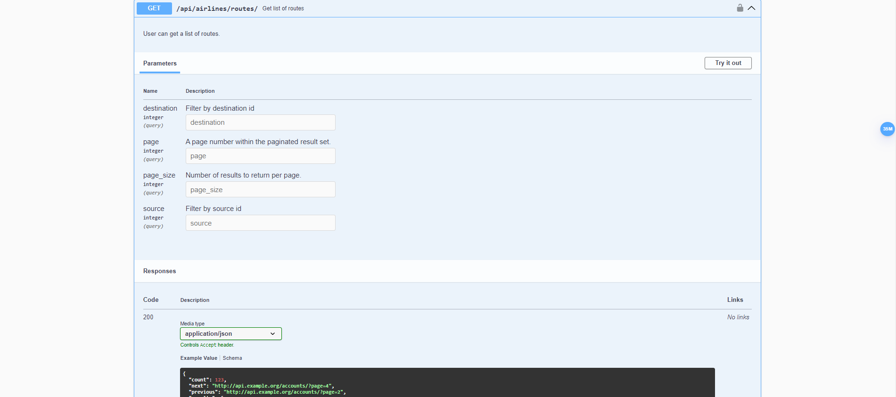

# Ukrainian Airlines

### About project:
This is the airline system with <span style="color:red">Celery</span>
 for managing flights across Ukraine.
The prototype of this project was the UkrZaliznytsia system with 
its route and ticket search system. 

In this project, we developed 
a search for flights from one airport to another with transfers 
using an optimized <span style="color:green">Dijkstra</span> algorithm limited to only one transfer.
```api/airlines/get-ways/```


### Technologies that was used:
1. Django Rest Framework (For managing api views)
2. Postgresql (As main database)
3. Celery (For managing completing flights that have departured)
4. Redis (As celery broker)
5. Docker-compose (For developing the microservices)
6. Swagger documentation

### How to run:
- Copy .env.sample -> .env and populate with all required data
- `docker-compose up --build`
- Create admin user (Optional)
- `docker-compose exec -ti api python manage.py createsuperuser`
- Load db data from file (Optional)
- `docker-compose exec -ti api python manage.py loaddata db_data.yaml`
- Create schedule in admin panel for running task 'Complete flight' in DB (Optional)

Test admin user:
username: `yaros`
password: `12345`

Test default user:
username: `yaros_test`
password: `12345`



